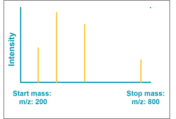
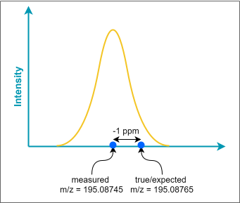
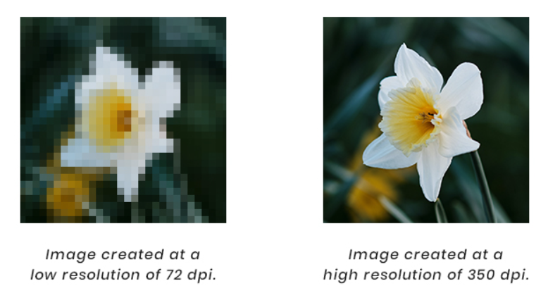
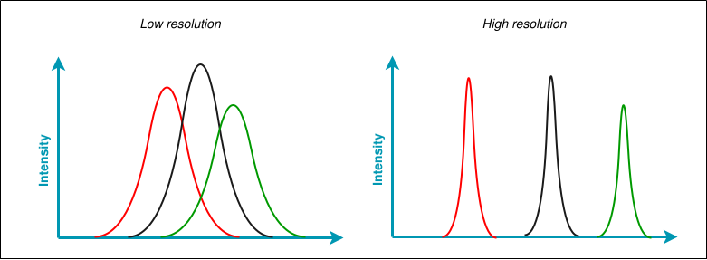
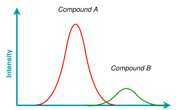
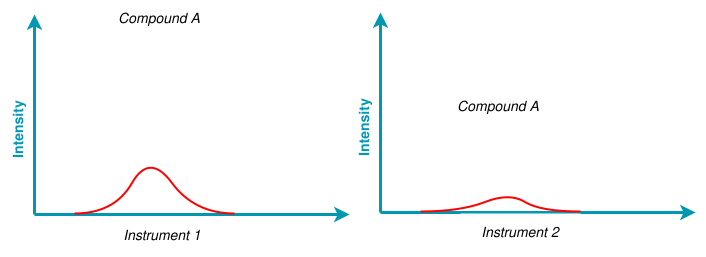
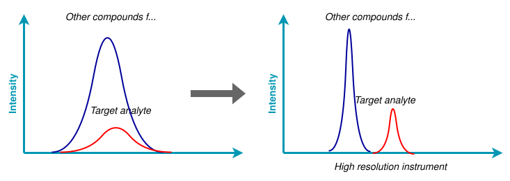
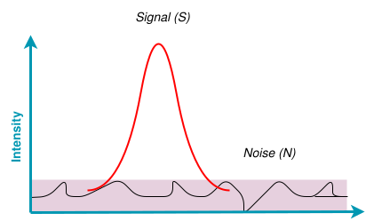

### Mass Range

Each type of mass spectrometer can detect ions within a specific range of mass-to-charge (m/z) values. Think of this like the field of view in photography—some lenses capture wide angles, while others zoom in on details. In mass spectrometry, you can control which ions are allowed to enter the instrument for detection.

For instance, in this example, the mass range is set between m/z 200 and m/z 900. By focusing only on the necessary range for your analysis, you can improve the quality of your data. 

### Mass Accuracy

Accuracy refers to how well an instrument can determine a specific value. For example, scales can measure different weights with varying degrees of accuracy, meaning how closely they can measure the actual weight of an object. Think of it like aiming for the Bull's Eye on a dartboard—the closer you get, the more accurate you are.

In mass spectrometry, mass accuracy is a measure of how well the instrument can determine the m/z (mass-to-charge) value of a molecule compared to the expected value. The closer these values match, the more reliable your analysis results will be. This accuracy is usually expressed in parts per million (ppm).

$$
Mass \; Accuracy = \frac{measured \; mass-true \; mass}{true \; mass} *10^6 
$$
For our caffeine example, let's cacluate the mass accuracy using the caffeine spectrum. 
$$
Mass \; Accuracy = \frac{195.08745- 195.08765}{195.08765} *10^6 = -1 \;ppm
$$

To ensure precise m/z ratio measurements, it is essential to perform an accurate mass calibration of the mass spectrometer. This calibration helps in making sure that the instrument provides accurate readings. 

### Scan Speed

In mass spectrometry, the detector doesn't continuously record incoming ions. Instead, it takes successive snapshots, called scans. You can think of these scans like frames in a movie. 

Imagine you're trying to take a photograph of people crossing a busy train station. If your camera takes pictures slowly, you might miss capturing some of the people in action. Similarly, in mass spectrometry, a slower scan speed increases the chances of missing some ions. Just as you would miss some of the people who move quickly through the station, a slow scan speed in mass spectrometry might fail to detect ions that are present for only a brief moment. 

The scan speed determines how many scans are taken over a certain period. If the scan speed is high, the detector captures more scans in a given time. This makes it less likely to miss any ions that enter the mass spectrometer.

### Mass Resolution

You might be familiar with the term "resolution" from your TV or camera, where it describes the amount of detail an image can show.

In a similar way, the mass resolution of a mass spectrometer refers to its ability to separate and distinguish different mass-to-charge (m/z) ratios. High mass resolution means the instrument can tell apart two very close m/z values, much like a high-resolution image can show fine details.  

Imagine you are analyzing a sample that contains two different peptides with very similar mass-to-charge (m/z) ratios: one peptide has an m/z value of 500.1 and the other has an m/z value of 500.2. These values are very close to each other, and distinguishing between them requires high mass resolution.

If you use a mass spectrometer with low mass resolution, the instrument might not be able to clearly separate these two peaks. Instead, you might see a single broad peak around m/z 500. This lack of resolution would make it difficult to identify the presence of both peptides accurately.

On the other hand, if you use a mass spectrometer with high mass resolution, the instrument can distinguish between the m/z values of 500.1 and 500.2. In this case, you would see two distinct peaks: one at m/z 500.1 and another at m/z 500.2. This high resolution allows you to accurately identify and quantify each peptide in your sample.

### Sensitivity

Sensitivity is a term that comes up often in different fields. Generally, it refers to the ability to detect something, like touch or pain. In the context of spectrometry, sensitivity is crucial. It defines how well the instrument can detect a specific compound. Good sensitivity allows you to detect lower concentration of analyte. 

Several factors influence sensitivity in mass spectrometry:

1. **Molecular Properties**: Different compounds have unique characteristics that can affect detection.

2. **Technical Specifications**: The design and capabilities of the mass spectrometer itself play a significant role.

3. **Sample Composition**: The presence of other molecules with similar mass in the sample can interfere with detection.
4. **Mass Resolution**: The instrument's ability to distinguish between molecules of similar mass also affects sensitivity.

Good sensitivity means you can detect and analyze lower concentrations of a substance. This is essential for accurate and reliable results in many scientific analyses. 

### Signal-to-Noise Ratio

The signal-to-noise ratio (SNR) is a key concept that helps us determine whether we can detect an important signal amidst surrounding noise. To find the SNR, you need to measure the intensity of both the signal and the noise. Then, you calculate the ratio of these two values.

In simple terms, the SNR tells us how much stronger the signal is compared to the noise. A higher SNR means the signal is easier to detect. Generally, a signal is considered detectable when the SNR is greater than 3. 

